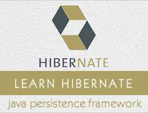

```
Roberto Nogueira  
BSd EE, MSd CE
Solution Integrator Experienced - Certified by Ericsson
```
# TutorialsPoint Hibernate



**About**

Learn everything you need to about the subject of this `Tutorialspoint` project.

[Homepage](https://www.tutorialspoint.com/hibernate/index.htm)

## Topics
```
Hibernate Tutorial
Hibernate - Home
ORM - Overview
[ ] Overview
[ ] Architecture
[ ] Environment
[ ] Configuration
[ ] Sessions
[ ] Persistent Class
[ ] Mapping Files
[ ] Mapping Types
[ ] Examples
[ ] O/R Mappings
[ ] Annotations
[ ] Query Language
[ ] Criteria Queries
[ ] Native SQL
[ ] Caching
[ ] Batch Processing
[ ] Interceptors
Hibernate Resources
[ ] Questions and Answers
[ ] Quick Guide
[ ] Useful Resources
[ ] Discussion
Selected Reading
[ ] Developer's Best Practices
[ ] Questions and Answers
[ ] Effective Resume Writing
[ ] HR Interview Questions
[ ] Computer Glossary
[ ] Who is Who
```
